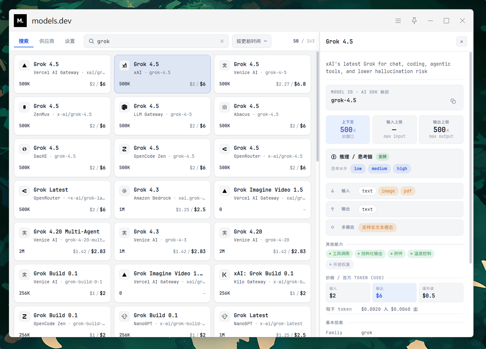
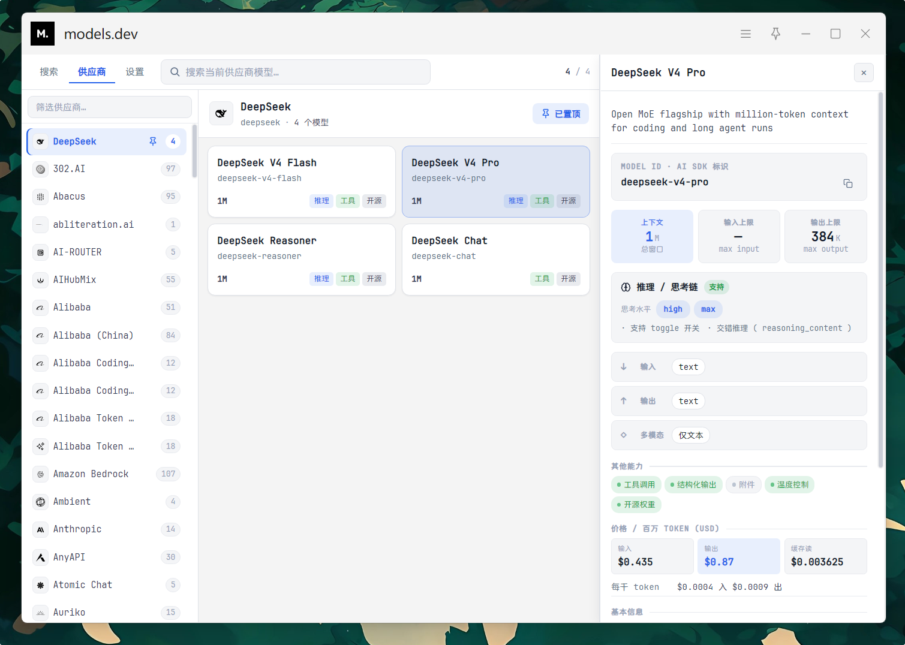
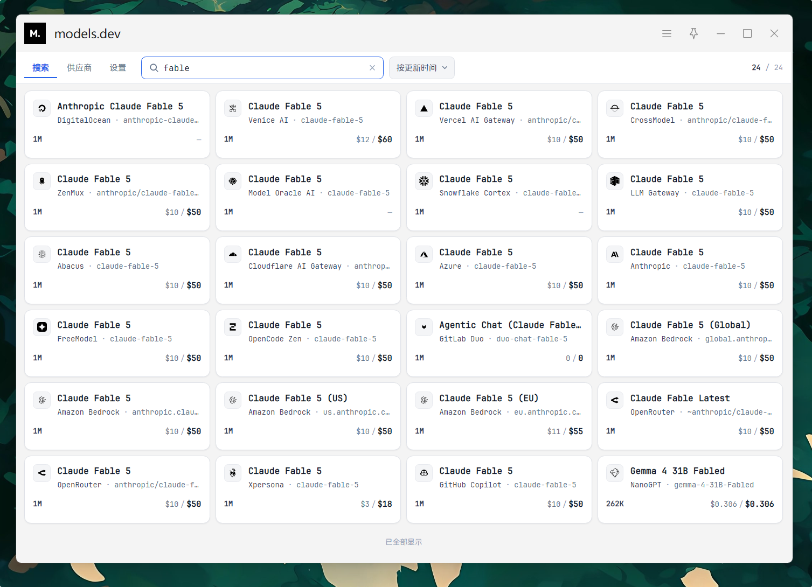

# models.dev（uTools 插件）

在 [uTools](https://u.tools/) 里查询 [models.dev](https://models.dev) 的 AI 模型目录：搜索、按供应商浏览、查看价格/上下文/能力等详情。

数据来自 <https://models.dev> — *An open-source database of AI models.*







## 功能

- **搜索**：按模型名 / 供应商 / family 筛选，排序，卡片列表 + 无限滚动
- **供应商**：左侧供应商列表（可置顶），右侧模型卡片
- **详情**：选中模型后右侧展示规格、价格、能力、文档链接等
- **设置**：全局字体、主题（系统 / 浅色 / 深色）
- **划词**：选中文本后可用「用 models.dev 查模型」直接搜索

默认打开指令：`models`、`模型`（见 `public/plugin.json`）。

## 技术栈

- Vue 3 + Vite 8
- Pinia + pinia-plugin-persistedstate
- uTools preload（Node `fs` / `https` 缓存 catalog 与 logo）

## 开发

需要 Node.js 与 [pnpm](https://pnpm.io/)。

```bash
pnpm install
pnpm dev      # http://127.0.0.1:5173
pnpm build    # 输出到 dist/
```

### 在 uTools 中调试

1. 打开 uTools → 插件应用 → 开发者工具
2. **开发模式**：`plugin.json` 中 `development.main` 指向 `http://localhost:5173`，先 `pnpm dev` 再加载本仓库（或构建产物目录，视你的加载方式而定）
3. **生产预览**：`pnpm build` 后加载 `dist/`（需保证 `plugin.json`、`preload/`、`logo.png` 随构建/复制可用）
4. 修改 `public/plugin.json`、`preload` 或 logo 后，在 uTools 中重新加载插件

### Lint

```bash
pnpm exec standard
pnpm exec standard --fix
```

当前未配置自动化测试。

## 目录概览

```
public/
  plugin.json          # uTools 清单（入口、logo、指令）
  logo.png             # 插件图标
  preload/services.js  # 拉 catalog、本地缓存、logo、复制
src/
  App.vue              # 顶栏 + Tab + 详情侧栏
  Models/              # 搜索 / 供应商 / 详情 / 设置
  stores/              # prefs（持久化）、ui（顶栏状态）
  main.css             # 主题 token
docs/models.dev.md     # 上游 models.dev 说明摘录
```

Catalog 缓存在 uTools `userData/modelsdev-data/`（因体积超过 `dbStorage` 限制，使用本地文件而非 db）。

## 数据说明

| 用途 | 地址 |
|------|------|
| 完整目录 | `https://models.dev/catalog.json` |
| 供应商 Logo | `https://models.dev/logos/{providerId}.svg` |

更完整的 API 说明见 [docs/models.dev.md](./docs/models.dev.md)。
